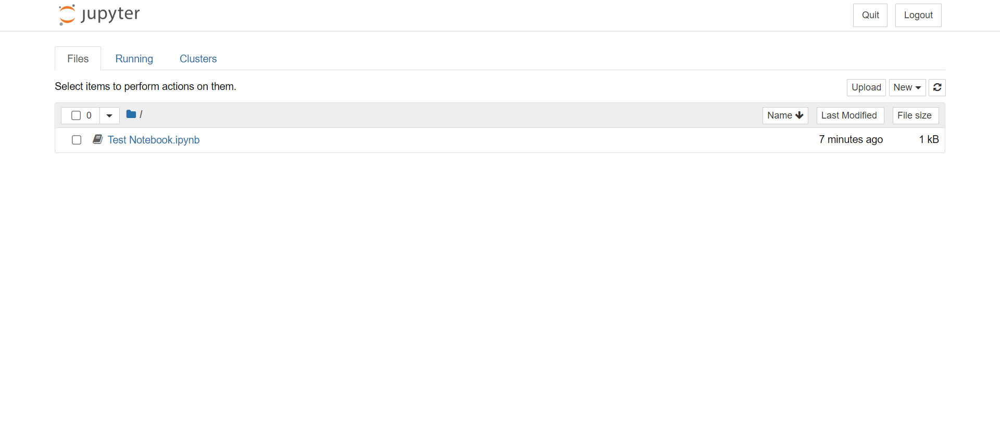
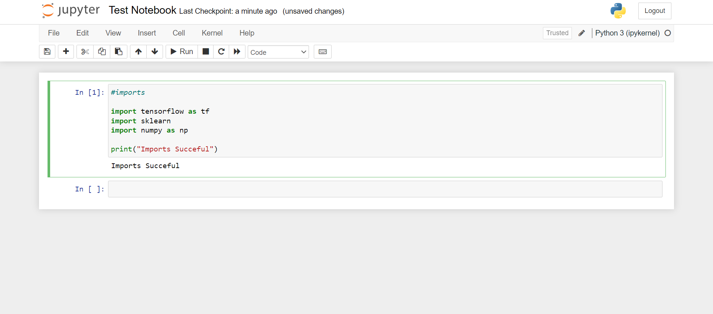

# cruX Summer Group 2021: Machine Learning Track

Hello everyone, welcome to the ML track of the cruX Summer Group 2021. Before we can get our hands dirty with the code, we need to set up a few things first.

## 1. Create the development environment

### Notes:

1. If you already know your way about Anaconda/Miniconda and python virtual environments, you can download the **[environment.yml](https://github.com/majimearun/crux-ml-summer-group-2022/blob/main/environment.yml)** file and skip this section.

2. While it is reccomended to use a local environment for your development, if there so is a need to use an online environment, you can alternatively use the **[google colab notebooks](https://colab.research.google.com/notebooks/intro.ipynb)** (which we will be providing for each topic) in the cloud. This allows you to learn and test your code without managing dependencies, but cannot be used for large datasets and projects.

3. For the sake of convinience across all platforms, we will be using the latest **Anaconda** distribution of Python.

### Downloading Anaconda

- Download Link: **[Anaconda](https://www.anaconda.com/products/distribution)**

Once downloaded, run the GUI installer with the default reccomended settings.

**Notes**:

1. If you prefer a lighter version of anaconda, without bloat packages or softwares, you can download **[miniconda](https://docs.conda.io/en/latest/miniconda.html)**, which installs just python and _conda_, a dependency and environment manager.

2. If you are using MacOS or Linux, download the script file from the link provided and run it to install Anaconda/Miniconda.

### Setting up the environment

Search for Anaconda Prompt in your search bar, and once you open it up, run the following command:

```bash
conda create --name crux-ml --file environment.yml
```

This will create a new virtual environment with all the required dependencies.
To use/activate this environment, run the following command:

```bash
conda activate crux-ml
```

Now you have access to all the dependenies you installed in this environment, and are just one step away from starting to code.

To deactivate this/current active environment, run the following command:

```bash
conda deactivate
```

#### Further Reading

For more insight on what exactly virtual environments are, how they work and how conda helps us, check out the following links (optional, but reccomended):

1. [Virtual Environments](https://whiteboxml.com/blog/the-definitive-guide-to-python-virtual-environments-with-conda)

2. [Managing environments using conda](https://docs.conda.io/projects/conda/en/latest/user-guide/tasks/manage-environments.html)

### Configuring the editor/ide

We leave the choice of editor/ide (from the vast set of options: Spyder, PyCharm, Jupyter Notebooks, Atom, VSCode, etc.) upto you, but will provide installation and setup instructions only for Jupyter Notebooks.

If you prefer to use a different editor/ide which can run **_.ipynb_** files like VSCode, you can use it if you do know it works, but for ease of teaching, we will stick to just running Jupyter Notebooks in the browser.

#### Jupyter Notebooks

The Jupyter Notebook is an open source web application that you can use to create and share documents that contain live code, equations, visualizations, and text. It's the easiest way to get started and it takes the interactive nature of python to the next level. In fact, you've already installed them in your environment!!

All you need to do is to navigate to the directory with the code (_\*.ipynb_ files) in your terminal/command prompt and run the following command:

```bash
jupyter notebook
```

which will open up an interface in your browser, from where you can create a new notebook as shown below:





Now select the notebook from the section of interest and you're all ready to start programming!!

To learn to navigate Jupyter Notebooks and their shortcuts that will a go a long way in improving your programming experience, check out the following links:

- [Jupyter Notebooks](https://www.youtube.com/watch?v=HW29067qVWk) (skip the installation part as you've already got it installed)

- [Jupyter Notebooks Shortcuts](https://towardsdatascience.com/jypyter-notebook-shortcuts-bf0101a98330)

Topics to be covered in this track:

1. Numeric and Data Manipulation using Numpy and Pandas
2. Data Visualization using Plotly
3. Intro to Machine Learning: Scikit-Learn
4. Regression Algorithms
5. Classification Algorithms
6. Unsupervised Learning: Clustering
7. Model Selection and Boosting
8. Timeseries Analysis
9. Intro to Neural Networks: Artificial Neural Networks (for both regression and classification)
